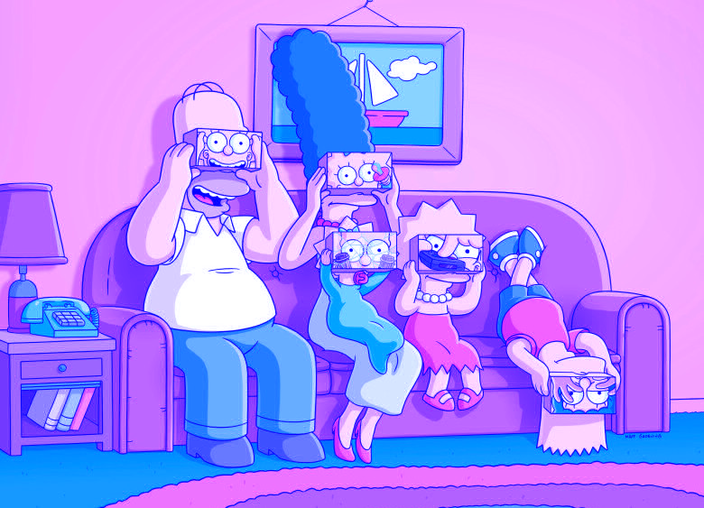
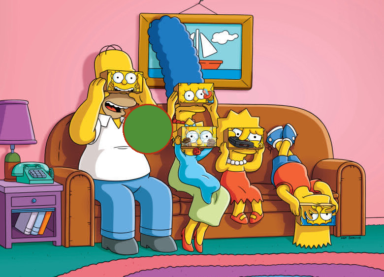
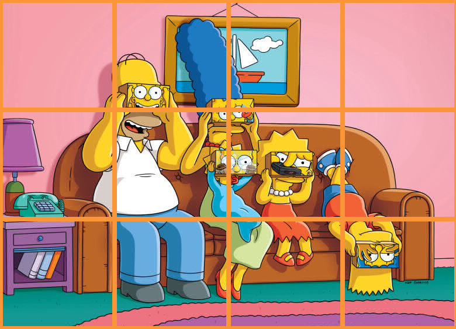

# BMP-image-editor

>Terminal version of the game "2048"

<h3> hey there
  
</h3>

Program allows to:
 
<ul>
  <li>
    Get info about image. (<i> -i </i>  or  <i> --info </i> <i>keys</i> );
  </li>
  <li>
    change image color ( <i> -F </i> or <i> --rgbFilter </i> <i> keys </i> );
  </li>
  <li>
    Split the image into pieces:
  <ul>
      <li>
        It`s possible by two ways:
        <li>
          First draws straight line image ( <i>-P</i> or <i>--drawParts</i> <i> keys </i> );
        </li>
        <li>
          The second one separates the image into files ( <i>-V</i> or <i>--saveParts</i> <i> keys </i> );
        </li>
  </ul>
  </li>
  <li>
    Draw circle:
    <ul>
      It`s possible by two ways:
      <li>
        First draws circle by centre coordinates and radius ( <i>-D</i> or <i>--drawCircleByRadius</i> <i> keys </i> );
      </li>
      <li>
        The second one draws circle by coordinates of the left top corner and right bottom corner ( <i>-S</i> or <i>--drawCircleBySquare</i> <i> keys </i> );
      </li>
    </ul>
  </li>
  <li>
    You can also call <i>-h</i> or <i>--help</i> for help;
  </li>
</ul>

<h2>Result of program:</h2>
<table border="1">
  <tr>
    <th>Our image</th>
    <th> </th>
   </tr>
   <tr>
    <td>RGB Filter</td>
    <td></td>
  </tr>
   <tr>
    <td>Drawing Circle</td>
    <td></td>
  </tr>
  <tr>
    <td>Division into parts</td>
    <td></td>
  </tr>
</table>
